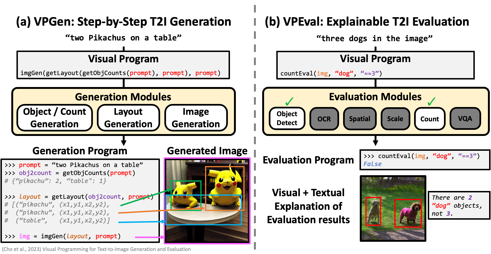

# VPEval
The code for **VPEval** a novel interpretable/explainable evaluation framework for T2I generation models, based
on visual programming, as described in the paper:

**[Visual Programming for Text-to-Image Generation and Evaluation](https://arxiv.org/abs/2305.15328)**

[Jaemin Cho](https://j-min.io),
[Abhay Zala](https://aszala.com/),
[Mohit Bansal](https://www.cs.unc.edu/~mbansal/)

[[Project Page](https://vp-t2i.github.io)]
[[Paper](https://arxiv.org/abs/2305.15328)]
[[Code for VPGen](https://github.com/j-min/VPGen)]
<a target="_blank" href="https://colab.research.google.com/github/aszala/VPEval/blob/main/inference.ipynb">
  
</a>


<br>

## Change Log
See our change log [here](CHANGELOG.md).

## Code Structure
```bash
# Evaluate Source Code
src/

# Data Files
data/

# Data Download and Code Run Scripts
scripts/
```

## Setup Environment
```bash
# Create a conda environment
conda create -n vpeval python=3.8
conda activate vpeval

# Install requirements
pip install -r requirements.txt

# Install 2nd requirements (as they must be installed second)
pip install -r requirements_2.txt
```
Then please follow directions on installing GroundingDINO: https://github.com/IDEA-Research/GroundingDINO

You also need to make sure you have downloaded the GroundingDINO weights and put them in the `weights` directory.
You can do this by running
```
bash scripts/download_grounding_dino_weights.sh
```

Then you can download and extract all the model generated images by running
```bash
bash scripts/download_images.sh
```

## Running Evaluation

Example outputs of our skill based evaluation.
<br><br>

To run skill based evaluation, please run
```bash
bash scripts/evaluate_skill_based.sh
```

Note: In the paper, we use the first 1000 IDs located in the `data/skill_based/random_ids_{skill}.json` file, where skill is any of object, count, spatial, etc.
- This is already implemented in the code

<hr>


Example outputs of our open ended evaluation process.
<br><br>

To run open ended evaluation, please run
```bash
bash scripts/evaluate_open_ended.sh
```

Then run the following to get the scores
```bash
python src/utils/score_open_ended.py
```

## Explaination Outputs
When running a script, pass the `--visualization_savepath` argument to choose where to save the explainations.
The visual explainations (bounding boxes) will be saved in the `../images/` directory and then a JSON file
will also be saved in the root path that includes the text explainations along with a path to the coorsponding images if it is available.

## Running End-to-End Inference
Please see `inference.ipynb` or <a target="_blank" href="https://colab.research.google.com/github/aszala/VPEval/blob/main/inference.ipynb">
  
</a>

## Generating Programs without ChatGPT API
We've released a fine-tuned (on ChatGPT outputs) LLama2 7B model.
If you do not want to use ChatGPT then you can use this model instead.
Please refer to this [code file](https://github.com/aszala/VPEval/blob/main/src/open_ended_prompt_generation/local_llm_program_generation/llama2_generation.py). 

# Citation

If you find our project useful in your research, please cite the following paper:

```bibtex
@inproceedings{Cho2023VPT2I,
  author    = {Jaemin Cho and Abhay Zala and Mohit Bansal},
  title     = {Visual Programming for Text-to-Image Generation and Evaluation},
  booktitle = {NeurIPS},
  year      = {2023},
}
```
